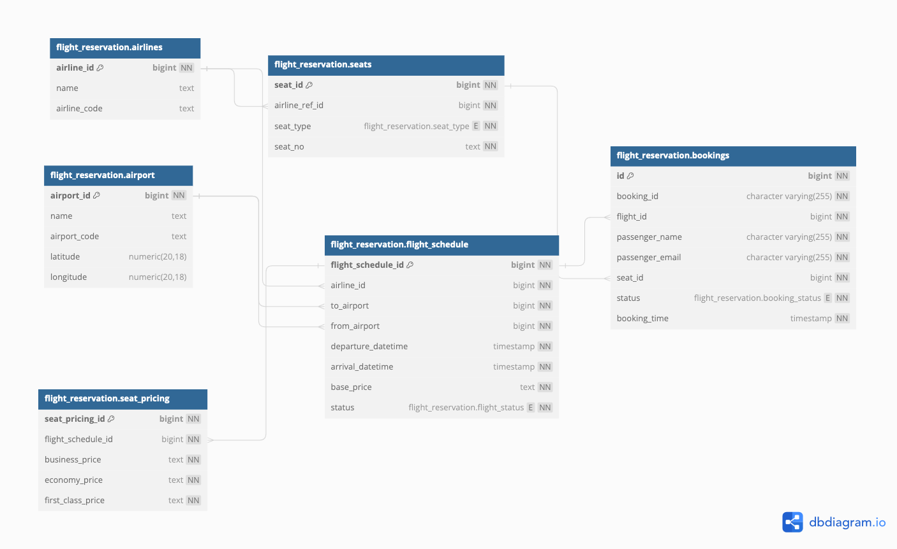
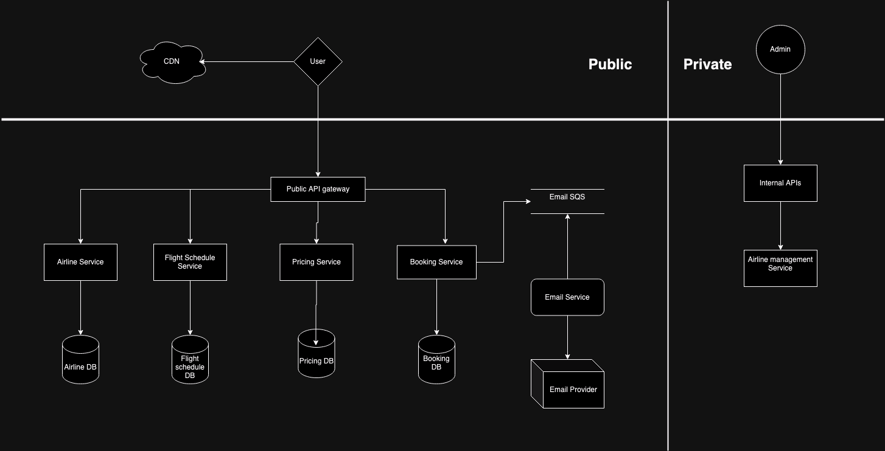

# Flight Reservation System

A rest-api back end to simulate a flight reservation system back-end
## Tools Used
- JAVA 8
- Spring Boot 2.7
- Postgres
- Jooq as an ORM alternative

## Basic Features

- API to add/update and view airline details
- API to add airline seats
- API to add a single or multiple flight schedules
- API to update individual flight schedules
- API to add/update pricing model for seats for a schedule
- API to view flight schedules based on search criteria
- API to view available seats for a flight schedule
- API to Book a flight
- API to view booking details

## Database Schemas

    If you want to view the design visit - [FlightReservationSystemSchema](https://dbdiagram.io/d/Flight-Reservation-System-Schema-Design-6679d51b9939893dae23a225)

## Populating the database and dataset

SQL Scripts to create the schema and tables can be found in the following file:
```
src\main\resources\templates\build.sql
```
## API End Points
The API end point details and description are present in below postman collection document
[FlightReservationSystem.postman_collection.json](FlightReservationSystem.postman_collection.json)
### Basic Response structure
Success Response:
* **Code:** 200
* **Content:** `
  {
  "statusCode": 1,
  "status": "Success",
  "message": "Airline added/updated successfully"
  }`

Error Response: 
* **Code:** 200
* **Content:** `{
  "statusCode": -1,
  "status": "Error",
  "message": "Seat 1 is already booked"
  }`


* **Code:** 400 BAD REQUEST
* **Content:** `{
  "errors": [
  "Airline name cannot be empty"
  ]
  }`


### High Level Design

- The HLD is based on how the system would work in a production environment with microservice architecture.
- CDN: For better load time, used to serve static assets lke videos, HTML etc. quickly.
- The API gateway will handle functionalities like load balancing, rate limiting and is configured to direct request to specific services based on endpoint.
- Internal APIs: Only available to flight admin staff to add and modify airline/flight details.
- `Airline Service`: View and service airline related details
- `Flight Schedule Service`: View and service flight schedule related details
- `Pricing Service`: View and service seat pricing related details
- `Booking Service` : Handle customer bookings
- `Email Service` : Send boarding confirmation Emails in an async flow using SQS


### Testing and running the application in Local

- Clone the source code for the project.
- Make sure to have **postgres** **maven** and **JAVA 8** installed.
- Connect to local postgres through any client or cli. Run the following file to generate all the tables required for the service: `src/main/resources/templates/build.sql`
- In `src/main/resources/application.properties` change the *"datasource configurations"* and *"jOOQ Configuration"* to point to your local postgres database where the tables are created in step 3.
- Build your maven project using: `mvn clean package -DskipTests -Pjooq`
- If Build is success run the application using: `mvn spring-boot:run` or directly run the `FlightReservationApplication.java class`. It will start the application on port `8080`

### Testing and running the application inside docker container

- Complete the steps as mentioned above for building the application in local
- In [docker-compose.yml](docker-compose.yml) file change the *"datasource configurations"* and *"jOOQ Configuration"* in accordance with your `application.properties` file
- Run command `docker-compose build` and `docker-compose up`. Your spring container should be up
- Copy the build.sql script from local to postgres image inside the app container - `docker cp /path/to/project/FlightReservation/src/main/resources/templates/build.sql postgres:/build.sql`
- Execute the script using `docker exec postgres sh -c "psql -U postgres -a -f /build.sql"`
- Execute APIs using the postman collection document


### Future Enhancements and Features(TO-DO)